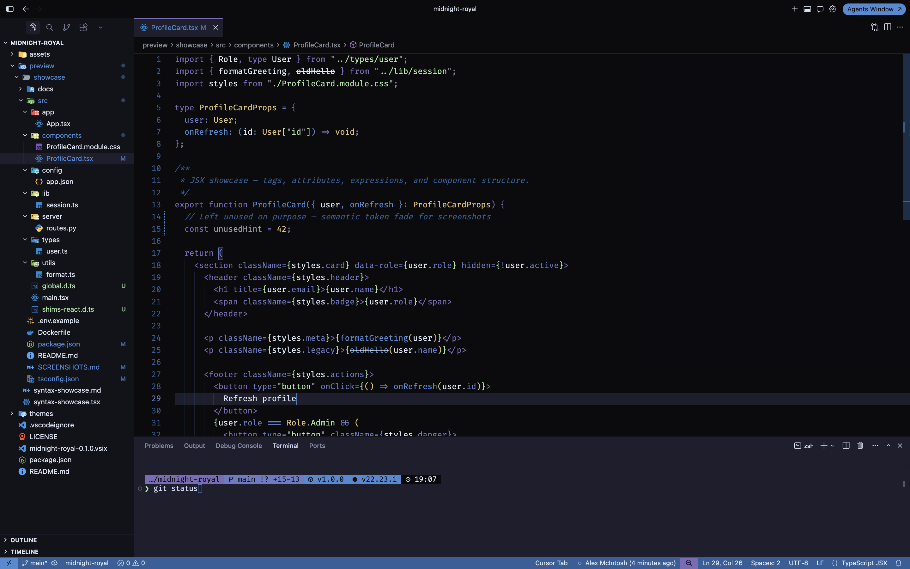
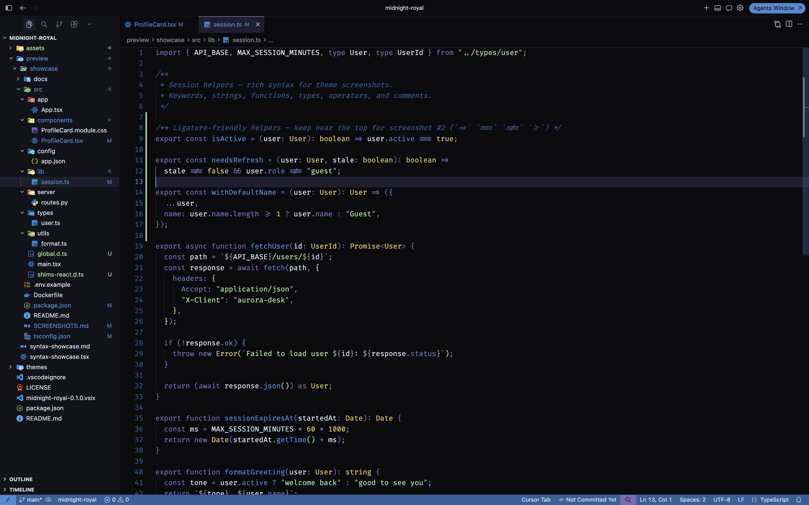
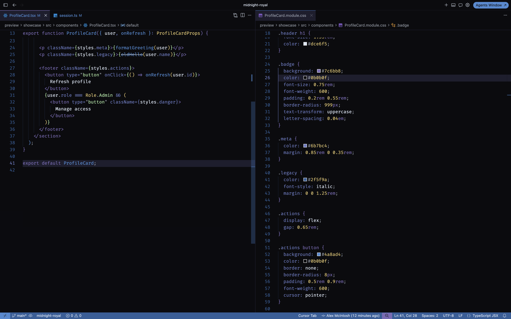
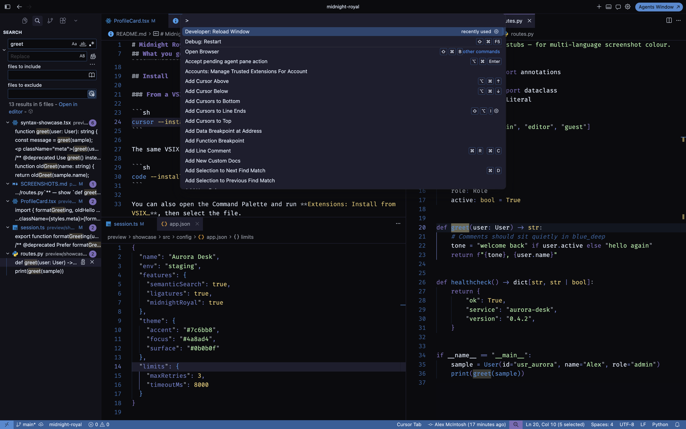

# Midnight Royal

A calm, dark **VS Code and Cursor** theme built around muted royal purple, cool blue, and soft pastel status colours.

Midnight Royal is designed to pair with the [Midnight Royal Starship prompt](https://github.com/mcintosh101/starship-midnight-royal), so your editor and terminal share one visual language without becoming overly bright.

## What you get

- A near-black editor surface with gently layered panels and sidebars
- Purple-to-blue accents for navigation, focus, functions, and links
- Soft green, red, and yellow feedback colours for strings, errors, warnings, and Git changes
- Integrated terminal colours matched to the Midnight Royal prompt
- Semantic highlighting for languages with a language server
- Fira Code Nerd Font and ligature-friendly defaults
- Material Icon Theme as the companion file icon pack

The colour theme works on its own. The font and icon settings are recommendations, not part of the colour theme itself.

## Gallery









## Install

### From a VSIX

```sh
cursor --install-extension ./midnight-royal-1.0.0.vsix
```

The same VSIX can be installed in VS Code:

```sh
code --install-extension ./midnight-royal-1.0.0.vsix
```

You can also open the Command Palette and run **Extensions: Install from VSIX…**, then select the file.

> The command-line examples assume `cursor` or `code` is available on your `PATH`. The graphical install works even when it is not.

### After install

1. Reload the window if prompted.
2. Run **Preferences: Color Theme** and select **Midnight Royal**.
3. Run **Preferences: File Icon Theme** and select **Material Icon Theme**.
4. Install [FiraCode Nerd Font](https://www.nerdfonts.com/) if it is not already installed.
5. Open a code file and check that `=>`, `!=`, and `===` render as ligatures.

The extension contributes defaults for the full setup, but existing user or workspace settings take precedence.

## Recommended settings

Midnight Royal contributes defaults for these settings:

| Setting | Value |
|---------|--------|
| Colour theme | Midnight Royal |
| Preferred dark theme | Midnight Royal |
| Icon theme | Material Icon Theme |
| Editor font | FiraCode Nerd Font Mono |
| Font ligatures | on |
| Editor font size | 15 |
| Word wrap | on |
| Terminal / debug / Markdown / SCM font size | 14 |

Defaults apply for unset keys; your existing user settings still win when already defined.

## Design

The theme is organised in three layers:

1. **Workbench** — editor surfaces, panels, tabs, lists, status bar, terminal, and overlays
2. **Syntax** — TextMate scopes for keywords, strings, functions, types, comments, and punctuation
3. **Semantic** — language-server tokens for classes, methods, properties, parameters, unused symbols, and deprecated APIs

The palette deliberately uses a small number of repeated colours. This keeps the interface recognisable and avoids assigning a new colour to every UI element.

## Palette

| Token | Hex | Role |
|-------|-----|------|
| `purple` | `#7c6bb8` | Keywords, accents, active tab |
| `purple_mid` | `#6b7bc4` | Properties, operators, git-adjacent UI |
| `blue` | `#4a8ad4` | Functions, links, focus, cursor |
| `blue_deep` | `#2f5f9a` | Status bar, comments, borders, selection |
| `black` | `#0b0b0f` | Editor background |
| `foam` | `#dce6f5` | Primary foreground |
| `ink` | `#0b0b0f` | Text on bright accents |
| `green` | `#a6e3a1` | Strings, success, additions |
| `red` | `#f38ba8` | Errors, deletions |
| `yellow` | `#e0c36c` | Types, numbers, warnings |

Also:

- `#1e1e2e` / `#cdd6f4` — panel + terminal (Starship / Warp ground)
- `#12121a` — activity bar + side bar mid-surface

## Develop and package

Clone or open the repository, edit the theme JSON, then validate and package it:

| Path | Purpose |
|------|---------|
| `package.json` | Extension manifest + recommended defaults |
| `themes/midnight-royal-color-theme.json` | Workbench, syntax, semantic colours |
| `preview/` | Syntax / Markdown samples (not packed into the VSIX) |

```sh
# Install the packaging tool temporarily and create a VSIX
npx --yes @vscode/vsce package

# Install the resulting package in Cursor
cursor --install-extension ./midnight-royal-1.0.0.vsix
```

After changing the theme, reinstall the VSIX and run **Developer: Reload Window** to ensure Cursor or VS Code is using the latest copy.

## Troubleshooting

### The theme does not appear

Confirm that the VSIX installed successfully, then reload the window. Open **Preferences: Color Theme** and search for `Midnight Royal`.

### Ligatures do not appear

Ligatures require both a compatible font and the setting:

```json
{
  "editor.fontFamily": "FiraCode Nerd Font Mono",
  "editor.fontLigatures": true
}
```

Restart or reload the editor after installing the font. A theme cannot bundle or install a font.

### Icons do not change

Material Icon Theme is a separate file icon theme. Run **Preferences: File Icon Theme** and choose it manually. If it is not installed, install the `PKief.material-icon-theme` extension.

### My existing settings did not change

That is expected. User and workspace settings override extension defaults. Inspect **Preferences: Open User Settings (JSON)** and `.vscode/settings.json` if a value is not the recommended one.

### The terminal looks different

The theme controls the integrated terminal colours, but your shell prompt is configured separately. For the matching prompt, install and configure [Midnight Royal Starship](https://github.com/mcintosh101/starship-midnight-royal).

## Licence

[MIT](LICENSE)
